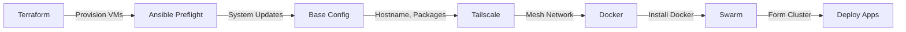

# Project DockerLab

> A comprehensive on-premises homelab running Docker Swarm on Proxmox VE.

## 🏗️ Architecture Overview

```
┌─────────────────────────────────────────────────────────────────────────┐
│                        Proxmox VE On-Premises                           │
├─────────────────────────────────────────────────────────────────────────┤
│                                                                         │
│  Managers:                                                              │
│       ┌───────────────┐    ┌───────────────┐    ┌───────────────┐      │
│       │   dkr-srv-1   │    │   dkr-srv-2   │    │   dkr-srv-3   │      │
│       │   (Manager)   │◄──►│   (Manager)   │◄──►│   (Manager)   │      │
│       │  10.0.30.21   │    │  10.0.30.22   │    │  10.0.30.23   │      │
│       └───────────────┘    └───────────────┘    └───────────────┘      │
│                                                                         │
│  Workers:                                                               │
│       ┌───────────────┐    ┌───────────────┐    ┌───────────────┐      │
│       │  dkr-wrkr-1   │    │  dkr-wrkr-2   │    │  dkr-wrkr-3   │      │
│       │   (Worker)    │    │   (Worker)    │    │   (Worker)    │      │
│       │  10.0.30.31   │    │  10.0.30.32   │    │  10.0.30.33   │      │
│       └───────────────┘    └───────────────┘    └───────────────┘      │
│                                                                         │
│                         Docker Swarm Cluster                            │
│                        (3 Managers + 3 Workers)                         │
│                                                                         │
│       ┌─────────────────────────────────────────────────────────┐      │
│       │                    Shared Storage                        │      │
│       │                  CephFS (/mnt/cephfs)                   │      │
│       └─────────────────────────────────────────────────────────┘      │
└─────────────────────────────────────────────────────────────────────────┘
```

| Component | Technology |
|-----------|------------|
| **Virtualization** | Proxmox VE |
| **Container Orchestration** | Docker Swarm |
| **Shared Storage** | CephFS |
| **Configuration Management** | Ansible |
| **Infrastructure as Code** | Terraform |
| **Secrets Management** | Doppler |
| **Task Runner** | Taskfile |
| **DNS Management** | Cloudflare |
| **Reverse Proxy** | Traefik |

## 📁 Project Structure

```
project-dockerlab/
├── ansible/                  # Configuration management
│   ├── group_vars/          # Variable definitions
│   ├── inventory/           # Host inventory
│   ├── roles/               # Ansible roles
│   │   ├── fresh_install/   # Base OS config, users, SSH, packages
│   │   ├── docker_swarm/    # Docker Swarm initialization
│   │   ├── portainer/       # Portainer deployment
│   │   ├── geerlingguy.docker/  # External role: Docker installation
│   │   └── geerlingguy.pip/     # External role: pip/Python dependencies
│   └── *.yml                # Playbooks
├── terraform_infra/         # Core infrastructure (Proxmox, Hetzner, networks)
├── terraform_apps/          # App-level IaC (DNS, Portainer stacks)
├── docker/                  # Swarm stacks and app configs
│   ├── traefik/             # Traefik reverse proxy stack
│   ├── socket-proxy/        # Docker socket proxy stack
│   ├── homepage/            # Homepage dashboard stack
│   ├── beszel/              # Beszel monitoring stack
│   ├── backup/              # Restic backup stack
│   ├── cloudflared/         # Cloudflare tunnel stack
│   └── ...                  # Other stacks
├── docs/                    # Detailed documentation
│   ├── ansible.md           # Ansible documentation
│   ├── terraform.md         # Terraform documentation
│   ├── doppler.md           # Doppler documentation
│   └── taskfile.md          # Taskfile documentation
├── archive/                 # Deprecated/backup files
├── taskfile/                # Task definitions
└── Taskfile.yml             # Main task runner config
```

## 🚀 Quick Start

### Prerequisites

- [Doppler CLI](https://docs.doppler.com/docs/install-cli) - Secrets management
- [Task](https://taskfile.dev/installation/) - Task runner
- [Terraform](https://terraform.io) - Infrastructure provisioning
- [Ansible](https://ansible.com) - Configuration management
- SSH access to Proxmox and target nodes

### 1. Configure Secrets

```bash
# Login to Doppler
doppler login

# Setup project
doppler setup
# Select: project-dockerlab / dev
```

### 2. Initialize Dependencies

```bash
# Initialize Terraform
task tf:init

# Install Ansible dependencies
task ansible:init
```

### 3. Deploy Infrastructure

```bash
# Preview infrastructure changes
task tf:plan

# Apply infrastructure
task tf:apply
```

### 4. Configure Systems

```bash
# Preview configuration changes
task ansible:site:plan

# Apply full configuration
task ansible:site:apply
```

### 5. Deploy Applications

```bash
# Deploy app stacks via Terraform (Portainer)
task tfa:apply

# Or deploy individual stacks manually
cd docker/traefik
docker stack deploy -c traefik-stack.yml traefik
```

## 📋 Infrastructure

### Nodes

| Node | IP Address | Role | Purpose |
|------|------------|------|---------|
| dkr-srv-1 | 10.0.30.21 | Manager | Swarm management, core services |
| dkr-srv-2 | 10.0.30.22 | Manager | Swarm management, core services |
| dkr-srv-3 | 10.0.30.23 | Manager | Swarm management, core services |
| dkr-wrkr-1 | 10.0.30.31 | Worker | Application workloads |
| dkr-wrkr-2 | 10.0.30.32 | Worker | Application workloads |
| dkr-wrkr-3 | 10.0.30.33 | Worker | Application workloads |
| gh-runner-1 | 10.0.30.40 | CI/CD | GitHub Actions self-hosted runner |

### Network Configuration

- **VLAN 30**: Docker/Container network (10.0.30.0/24)
- **VLAN 40**: Proxmox management (10.0.40.0/24)

## 🔧 Common Tasks

```bash
# List all available tasks
task --list-all

# Terraform
task tf:plan            # Preview infrastructure changes
task tf:apply           # Apply infrastructure
task tf:destroy         # Destroy all infrastructure

# Ansible
task ansible:site:apply       # Full site deployment
task ansible:preflight:apply  # System updates
task ansible:docker:apply     # Docker installation only
task ansible:tailscale:apply  # Tailscale setup only
```

## 📚 Documentation

Detailed documentation for each component:

| Document | Description |
|----------|-------------|
| [Ansible](docs/ansible.md) | Playbooks, roles, and configuration |
| [Terraform](docs/terraform.md) | Infrastructure provisioning |
| [Doppler](docs/doppler.md) | Secrets management |
| [Taskfile](docs/taskfile.md) | Task runner commands |
| [Cloudflare Tunnel Setup](docker/cloudflared/setup.md) | Secure remote access without opening external ports |
| [Dockpeek Setup](docker/dockpeek/setup.md) | Simple Docker container explorer |
| [Glance Setup](docker/glance/setup.md) | Self-hosted dashboard |
| [Monitoring Setup](docker/monitoring/setup.md) | Docker Swarm monitoring solution |
| [Traefik Setup](docker/traefik/setup.md) | Traefik Ingress Controller |

## 🖼️ Base Image Creation

### Creating a Debian 13 VM Template

1. **Access Proxmox Community Scripts**
   - Visit: https://community-scripts.github.io/ProxmoxVE/scripts?id=debian-13-vm

2. **Run the Script**
   - Open Proxmox Shell
   - Copy and execute the community script

3. **Convert to Template**
   - Right-click VM → "Convert to Template"
   - Template ID: 9008 (used in Terraform)

4. **Template Naming**
   - Recommended: `debian13-docker-template`

## 🔐 Secrets Management

All secrets are managed through [Doppler](https://doppler.com). See [Doppler Documentation](docs/doppler.md) for setup details.

## 🐳 Applications

Swarm stacks are in the `docker/` directory:

### whoami

A simple Traefik whoami service for testing Swarm deployments:

```bash
cd docker/traefik
docker stack deploy -c whoami-stack.yml whoami
```


#### Cloudflare Tunnel

Secure remote access without opening external ports. See [Cloudflare Tunnel Setup](docker/cloudflared/setup.md) for details.

#### Dockpeek

A simple Docker container explorer. See [Dockpeek Setup](docker/dockpeek/setup.md) for details.

#### Glance

A self-hosted dashboard that puts all your feeds in one place. See [Glance Setup](docker/glance/setup.md) for details.

#### Monitoring (Prometheus & Grafana)

A complete monitoring solution for Docker Swarm. See [Monitoring Setup](docker/monitoring/setup.md) for details.

#### Traefik

Traefik Ingress Controller. See [Traefik Setup](docker/traefik/setup.md) for details.

#### Ghost

Ghost is a powerful open-source blogging and publishing platform. See [Ghost Setup](docker/ghost/setup.md) for details.

#### Backup

Automated backup solution using Restic with support for Backblaze B2, AWS S3, or SFTP storage. See [Backup Setup](docker/backup/setup.md) for details.

**Features:**
- Pre-backup database dumps (MySQL, Postgres)
- Incremental, deduplicated, encrypted backups
- Automatic retention (7 daily, 4 weekly, 3 monthly)
- Discord notifications

#### OtterWiki

A minimal, self-hosted wiki with Markdown and Git version control.

**Required Doppler Secrets:** None (first registered user becomes admin)

#### Linkwarden

A collaborative bookmark manager that preserves webpages. Deployed on worker nodes.

**URL:** `https://links.yourdomain.com`

**Required Doppler Secrets:**
| Secret | Description |
|--------|-------------|
| `LINKWARDEN_POSTGRES_PASSWORD` | PostgreSQL password for database |
| `LINKWARDEN_NEXTAUTH_SECRET` | Secret for session encryption (generate with `openssl rand -base64 32`) |
| `LINKWARDEN_MEILI_KEY` | Meilisearch master key for search (generate with `openssl rand -base64 32`) |

#### Jellyfin

Open-source media server. Deployed on worker nodes with access to shared media library.

**URL:** `https://jelly.yourdomain.com`

**Required Doppler Secrets:** None (first user becomes admin)

#### Plex (QNAP Secondary Environment)

Media server running on QNAP NAS, routed through Traefik on the primary swarm.

**Required Doppler Secrets:**
| Secret | Description |
|--------|-------------|
| `PLEX_CLAIM` | Claim token from https://plex.tv/claim (expires in 4 minutes) |

#### Grafana Alloy

Metrics and logs collector for Grafana Cloud. Runs globally on all swarm nodes.

**Required Doppler Secrets:**
| Secret | Description | Where to find |
|--------|-------------|---------------|
| `GRAFANA_CLOUD_PROMETHEUS_URL` | Remote write URL (e.g., `https://prometheus-prod-xx-xxx.grafana.net/api/prom/push`) | Grafana Cloud → Connections → Hosted Prometheus → Details |
| `GRAFANA_CLOUD_PROMETHEUS_USERNAME` | Numeric username/ID | Same page as above |
| `GRAFANA_CLOUD_LOKI_URL` | Loki push URL (e.g., `https://logs-prod-xxx.grafana.net/loki/api/v1/push`) | Grafana Cloud → Connections → Hosted Logs → Details |
| `GRAFANA_CLOUD_LOKI_USERNAME` | Numeric username/ID | Same page as above |
| `GRAFANA_CLOUD_API_KEY` | API key with `MetricsPublisher` and `LogsPublisher` permissions | Grafana Cloud → Administration → API Keys → Add API Key |

**How to get Grafana Cloud credentials:**
1. Go to [grafana.com](https://grafana.com) → Sign in
2. Navigate to **My Account** → Your Grafana Cloud stack
3. Click **Connections** → **Hosted Prometheus** → Copy the Remote Write URL and Username
4. Click **Connections** → **Hosted Logs** → Copy the Push URL and Username
5. Go to **Administration** → **API Keys** → **Add API Key**
   - Name: `alloy-homelab`
   - Role: `MetricsPublisher` (create another for `LogsPublisher` or use Admin)
6. Add all values to Doppler

## 🔐 Required Doppler Secrets

| Secret | Purpose |
|--------|---------|
| `PROXMOX_AUTH_TOKEN` | Proxmox VE API |
| `CLOUDFLARE_API_TOKEN` | Cloudflare DNS |
| `GHOST_DB_PASSWORD` | MySQL password for Ghost database user |
| `GHOST_DB_ROOT_PASSWORD` | MySQL root password for Ghost database |
| `GHOST_MAIL_TRANSPORT` | Mail transport (e.g., `SMTP`) - optional |
| `GHOST_MAIL_HOST` | SMTP host - optional |
| `GHOST_MAIL_PORT` | SMTP port - optional |
| `GHOST_MAIL_USER` | SMTP username - optional |
| `GHOST_MAIL_PASSWORD` | SMTP password - optional |
| `GHOST_MAIL_FROM` | From address for emails - optional |
| `PLEX_CLAIM` | Plex claim token (get from https://plex.tv/claim) |
| `GRAFANA_CLOUD_PROMETHEUS_URL` | Grafana Cloud Prometheus remote write URL |
| `GRAFANA_CLOUD_PROMETHEUS_USERNAME` | Grafana Cloud Prometheus username |
| `GRAFANA_CLOUD_LOKI_URL` | Grafana Cloud Loki push URL |
| `GRAFANA_CLOUD_LOKI_USERNAME` | Grafana Cloud Loki username |
| `GRAFANA_CLOUD_API_KEY` | Grafana Cloud API key |
| `BESZEL_AGENT_KEY` | Beszel agent key (get from Beszel hub UI) |
| `LINKWARDEN_POSTGRES_PASSWORD` | PostgreSQL password for Linkwarden |
| `LINKWARDEN_NEXTAUTH_SECRET` | NextAuth session secret for Linkwarden |
| `LINKWARDEN_MEILI_KEY` | Meilisearch master key for Linkwarden |
| `GITHUB_RUNNER_REPO_URL` | GitHub repository URL for self-hosted runner (e.g., `https://github.com/owner/repo`) |
| `GITHUB_RUNNER_TOKEN` | GitHub Actions runner registration token (from GitHub Repository Settings > Actions > Runners) |

## 🔄 Container Image Updates

Docker image updates are managed via [Renovate](https://docs.renovatebot.com/), configured in `renovate.json`:

- **Automatic PRs**: Renovate scans all `docker/*-stack.yml` files and creates PRs when new image versions are available
- **Minor/Patch updates**: Created as normal PRs for easy merging
- **Major updates**: Labeled with `major-update` and `review-required` for careful review

After merging a Renovate PR, redeploy the affected stack:

```bash
docker stack deploy -c docker/<app>/<app>-stack.yml <app>
```

## 🔄 Deployment Workflow



## 🚀 Bonus: Automated Deployment Pipeline

For those who want to loosely couple the deployment stages without a full CI/CD server, we've added automated pipeline options:

- **One-command deployment**: `task deploy` runs the full Terraform → Ansible → Terraform pipeline sequentially
- **Enhanced scripting**: `./scripts/deploy.sh` provides detailed logging and error handling
- **Event-driven options**: Webhook receiver for external triggering

See [Deployment Pipeline Plan](plans/deployment_pipeline_plan.md) for detailed implementation options and comparisons.

## 🛠️ Troubleshooting

### SSH Connection Issues

```bash
# Test connectivity
ansible -i ansible/inventory/hosts all -m ping
```

### Tailscale Issues

```bash
# Check Tailscale status on a node
tailscale status
tailscale ip -4
```

### Docker Swarm Issues

```bash
# Check swarm status
docker node ls
docker service ls
```

## 📝 License

This project is for personal homelab use.

## 🙏 Acknowledgments

- [Proxmox Community Scripts](https://community-scripts.github.io/ProxmoxVE/)
- [Geerlingguy Ansible Roles](https://github.com/geerlingguy)
- [Tailscale](https://tailscale.com)
