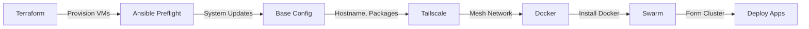

# Project DockerLab

> A comprehensive hybrid homelab setup combining cloud and on-premises infrastructure with Docker Swarm orchestration.

## 🏗️ Architecture Overview

```
┌─────────────────────────────────────────────────────────────────────────┐
│                           Tailscale Mesh Network                        │
├─────────────────────────────────────────────────────────────────────────┤
│                                                                         │
│  ┌─────────────────────┐              ┌─────────────────────────────┐  │
│  │   Hetzner Cloud     │              │      Proxmox On-Premises    │  │
│  │                     │              │                             │  │
│  │  ┌───────────────┐  │              │  ┌───────────┐ ┌─────────┐  │  │
│  │  │  dkr-srv-0    │  │◄────────────►│  │ dkr-srv-1 │ │dkr-srv-2│  │  │
│  │  │  (Manager)    │  │              │  │ (Manager) │ │(Manager)│  │  │
│  │  └───────────────┘  │              │  └───────────┘ └─────────┘  │  │
│  │                     │              │                             │  │
│  └─────────────────────┘              └─────────────────────────────┘  │
│                                                                         │
│                        Docker Swarm Cluster                            │
└─────────────────────────────────────────────────────────────────────────┘
```

| Component | Technology |
|-----------|------------|
| **Virtualization** | Proxmox VE |
| **Cloud Provider** | Hetzner Cloud |
| **Container Orchestration** | Docker Swarm |
| **Mesh Networking** | Tailscale |
| **Configuration Management** | Ansible |
| **Infrastructure as Code** | Terraform |
| **Secrets Management** | Doppler |
| **Task Runner** | Taskfile |
| **DNS Management** | Cloudflare |

## 📁 Project Structure

```
project-dockerlab/
├── ansible/                  # Configuration management
│   ├── group_vars/          # Variable definitions
│   ├── inventory/           # Host inventory
│   ├── roles/               # Ansible roles
│   │   ├── common_base/     # Base system configuration
│   │   ├── dokploy/         # Dokploy deployment
│   │   ├── portainer_be/    # Portainer Business Edition
│   │   ├── swarm_bootstrap/ # Docker Swarm initialization
│   │   ├── swarm_labels/    # Swarm node labeling
│   │   ├── system_update/   # System updates
│   │   └── tailscale_post/  # Tailscale post-config
│   └── *.yml                # Playbooks
├── terraform/               # Infrastructure as code
│   ├── modules/             # Reusable modules
│   │   ├── hetzner-cloud/   # Hetzner server module
│   │   └── proxmox-vm/      # Proxmox VM module
│   └── *.tf                 # Terraform configs
├── apps/                    # Docker applications
│   └── whoami/              # Example swarm service
├── docs/                    # Detailed documentation
│   ├── ansible.md           # Ansible documentation
│   ├── terraform.md         # Terraform documentation
│   ├── doppler.md           # Doppler documentation
│   └── taskfile.md          # Taskfile documentation
├── archive/                 # Deprecated/backup files
├── taskfile/                # Task definitions
└── Taskfile.yml             # Main task runner config
```

## 🚀 Quick Start

### Prerequisites

- [Doppler CLI](https://docs.doppler.com/docs/install-cli) - Secrets management
- [Task](https://taskfile.dev/installation/) - Task runner
- [Terraform](https://terraform.io) - Infrastructure provisioning
- [Ansible](https://ansible.com) - Configuration management
- SSH access to Proxmox and target nodes

### 1. Configure Secrets

```bash
# Login to Doppler
doppler login

# Setup project
doppler setup
# Select: project-dockerlab / dev
```

### 2. Initialize Dependencies

```bash
# Initialize Terraform
task tf:init

# Install Ansible dependencies
task ansible:init
```

### 3. Deploy Infrastructure

```bash
# Preview infrastructure changes
task tf:plan

# Apply infrastructure
task tf:apply
```

### 4. Configure Systems

```bash
# Preview configuration changes
task ansible:site:plan

# Apply full configuration
task ansible:site:apply
```

## 📋 Infrastructure

### Nodes

| Node | Location | IP Address | Role |
|------|----------|------------|------|
| dkr-srv-0 | Hetzner Helsinki | 157.180.84.140 | Swarm Manager |
| dkr-srv-1 | On-premises | 10.0.30.11 | Swarm Manager |
| dkr-srv-2 | On-premises | 10.0.30.12 | Swarm Manager |

### Network Configuration

- **VLAN 30**: Docker/Container network (10.0.30.0/24)
- **VLAN 40**: Proxmox management (10.0.40.0/24)
- **Tailscale**: Secure mesh overlay across all nodes

## 🔧 Common Tasks

```bash
# List all available tasks
task --list-all

# Terraform
task tf:plan            # Preview infrastructure changes
task tf:apply           # Apply infrastructure
task tf:destroy         # Destroy all infrastructure

# Ansible
task ansible:site:apply       # Full site deployment
task ansible:preflight:apply  # System updates
task ansible:docker:apply     # Docker installation only
task ansible:tailscale:apply  # Tailscale setup only
```

## 📚 Documentation

Detailed documentation for each component:

| Document | Description |
|----------|-------------|
| [Ansible](docs/ansible.md) | Playbooks, roles, and configuration |
| [Terraform](docs/terraform.md) | Infrastructure provisioning |
| [Doppler](docs/doppler.md) | Secrets management |
| [Taskfile](docs/taskfile.md) | Task runner commands |
| [Cloudflare Tunnel Setup](docker/cloudflared/setup.md) | Secure remote access without opening external ports |
| [Dockpeek Setup](docker/dockpeek/setup.md) | Simple Docker container explorer |
| [Glance Setup](docker/glance/setup.md) | Self-hosted dashboard |
| [Monitoring Setup](docker/monitoring/setup.md) | Docker Swarm monitoring solution |
| [Traefik Setup](docker/traefik/setup.md) | Traefik Ingress Controller |

## 🖼️ Base Image Creation

### Creating a Debian 13 VM Template

1. **Access Proxmox Community Scripts**
   - Visit: https://community-scripts.github.io/ProxmoxVE/scripts?id=debian-13-vm

2. **Run the Script**
   - Open Proxmox Shell
   - Copy and execute the community script

3. **Convert to Template**
   - Right-click VM → "Convert to Template"
   - Template ID: 9008 (used in Terraform)

4. **Template Naming**
   - Recommended: `debian13-docker-template`

## 🔐 Secrets Management

All secrets are managed through [Doppler](https://doppler.com):

| Secret | Purpose |
|--------|---------|
| `HCLOUD_TOKEN` | Hetzner Cloud API |
| `PROXMOX_AUTH_TOKEN` | Proxmox VE API |
| `CLOUDFLARE_API_TOKEN` | Cloudflare DNS |
| `TAILSCALE_AUTH_KEY` | Tailscale network |

See [Doppler Documentation](docs/doppler.md) for setup details.

## 🐳 Applications

Example applications are in the `apps/` directory:

### whoami

A simple Traefik whoami service for testing Swarm deployments:

```bash
cd apps/whoami
docker stack deploy -c docker-compose.yaml whoami
```
```

#### Cloudflare Tunnel

Secure remote access without opening external ports. See [Cloudflare Tunnel Setup](docker/cloudflared/setup.md) for details.

#### Dockpeek

A simple Docker container explorer. See [Dockpeek Setup](docker/dockpeek/setup.md) for details.

#### Glance

A self-hosted dashboard that puts all your feeds in one place. See [Glance Setup](docker/glance/setup.md) for details.

#### Monitoring (Prometheus & Grafana)

A complete monitoring solution for Docker Swarm. See [Monitoring Setup](docker/monitoring/setup.md) for details.

#### Traefik

Traefik Ingress Controller. See [Traefik Setup](docker/traefik/setup.md) for details.

## 🔄 Deployment Workflow



## 🛠️ Troubleshooting

### SSH Connection Issues

```bash
# Test connectivity
ansible -i ansible/inventory/hosts all -m ping
```

### Tailscale Issues

```bash
# Check Tailscale status on a node
tailscale status
tailscale ip -4
```

### Docker Swarm Issues

```bash
# Check swarm status
docker node ls
docker service ls
```

## 📝 License

This project is for personal homelab use.

## 🙏 Acknowledgments

- [Proxmox Community Scripts](https://community-scripts.github.io/ProxmoxVE/)
- [Geerlingguy Ansible Roles](https://github.com/geerlingguy)
- [Tailscale](https://tailscale.com)
