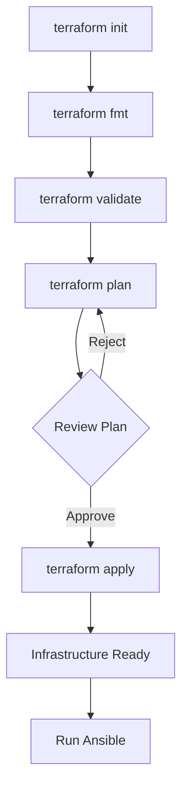

# Terraform Documentation

This document provides comprehensive documentation for the Terraform infrastructure-as-code setup in project-dockerlab.

## Overview

Terraform is used to provision and manage infrastructure across multiple providers:
- **Proxmox** - On-premises VM creation
- **Hetzner Cloud** - Cloud VM provisioning
- **Cloudflare** - DNS management

## Directory Structure

```
terraform/
├── modules/
│   ├── hetzner-cloud/    # Hetzner Cloud server module
│   └── proxmox-vm/       # Proxmox VM module
├── main_cloudflare.tf    # Cloudflare DNS configuration
├── main_hcloud.tf        # Hetzner Cloud resources
├── main_local.tf         # Local resources
├── main_proxmox.tf       # Proxmox VM resources
├── providers.tf          # Provider configurations
└── coolify_userdata.tftpl # Cloud-init template
```

## Providers

### Hetzner Cloud

```hcl
provider "hcloud" {
  token = var.HCLOUD_TOKEN
}
```

Used for provisioning cloud VMs with:
- Server creation
- Firewall configuration
- SSH key management

### Proxmox

```hcl
provider "proxmox" {
  endpoint  = "https://10.0.40.10:8006/"
  api_token = var.PROXMOX_AUTH_TOKEN
  insecure  = true
  ssh {
    username    = "root"
    agent       = false
    private_key = file(pathexpand(var.proxmox_ssh_private_key_file))
  }
}
```

Used for:
- VM creation from templates
- VM configuration
- Cloud-init setup

### Cloudflare

```hcl
provider "cloudflare" {
  api_token = var.CLOUDFLARE_API_TOKEN
}
```

Used for:
- DNS record management
- Zone configuration

## Resources

### Hetzner Cloud Server (dkr-srv-0)

| Property | Value |
|----------|-------|
| Name | dkr-srv-0 |
| Image | Ubuntu 22.04 |
| Type | cx23 (2 vCPU, 4GB RAM) |
| Location | Helsinki (hel1) |
| IPv4 | Enabled |
| IPv6 | Enabled |

#### Firewall Rules

| Direction | Protocol | Port | Description |
|-----------|----------|------|-------------|
| Inbound | TCP | 22 | SSH |
| Inbound | TCP | 80 | HTTP |
| Inbound | TCP | 443 | HTTPS |
| Inbound | TCP | 3000 | Dokploy UI |

### Proxmox VMs

#### Common Configuration

| Property | Value |
|----------|-------|
| Template ID | 9008 |
| Memory | 4096 MB |
| CPU Cores | 2 |
| CPU Sockets | 1 |
| Disk Size | 30 GB |
| Disk Storage | ceph-proxmox-rbd |
| Network | vmbr0 (VLAN 30) |
| DNS | 9.9.9.9, 149.112.112.112 |

#### VM Instances

| Node | VM ID | IPv4 Address | Gateway |
|------|-------|--------------|---------|
| dkr-srv-1 | 3021 | 10.0.30.21/24 | 10.0.30.1 |
| dkr-srv-2 | 3022 | 10.0.30.22/24 | 10.0.30.1 |
| dkr-srv-3 | 3023 | 10.0.30.23/24 | 10.0.30.1 |

### Network Configuration

- **VLAN 30**: Container Network (10.0.30.0/24)
- **VLAN 40**: Management Network (10.0.40.0/24)


## Modules

### hetzner-cloud

Creates a complete Hetzner Cloud server with:
- SSH key configuration
- Firewall setup
- User data (cloud-init)

**Inputs:**
- `server_name` - Name of the server
- `server_image` - OS image to use
- `server_type` - Server size
- `location` - Datacenter location
- `ssh_public_key` - SSH public key
- `firewall_name` - Name for the firewall
- `firewall_rules` - List of firewall rules
- `user_data` - Cloud-init configuration

### proxmox-vm

Creates a Proxmox VM from template with:
- Clone configuration
- Hardware settings
- Network configuration
- Cloud-init setup

**Key Inputs:**
- `name` - VM name
- `vm_id` - Proxmox VM ID
- `template_vm_id` - Template to clone from
- `memory_dedicated` - RAM in MB
- `cpu_cores` - Number of CPU cores
- `disk_size` - Disk size in GB
- `ipv4_address` - Static IP address
- `ssh_keys` - List of authorized SSH keys

## Required Variables

All sensitive variables are managed through Doppler:

| Variable | Description |
|----------|-------------|
| `HCLOUD_TOKEN` | Hetzner Cloud API token |
| `TAILSCALE_AUTH_KEY` | Tailscale authentication key |
| `PROXMOX_AUTH_TOKEN` | Proxmox API token |
| `CLOUDFLARE_API_TOKEN` | Cloudflare API token |
| `CLOUDFLARE_ACCOUNT_ID` | Cloudflare account ID |
| `CLOUDFLARE_ZONE_ID` | Cloudflare zone ID |

## Common Commands

```bash
# Initialize Terraform
task tf:init

# Format and validate configuration
task tf:fmt

# Create execution plan
task tf:plan

# Apply changes
task tf:apply

# Destroy infrastructure
task tf:destroy
```

## Outputs

### Hetzner Cloud

| Output | Description |
|--------|-------------|
| `dkr_srv_0_name` | Server name |
| `dkr_srv_0_ipv4` | Public IPv4 address |
| `dkr_srv_0_ipv6` | Public IPv6 address |

### Proxmox

| Output | Description |
|--------|-------------|
| `dkr_srv_1_vm_id` | VM ID for dkr-srv-1 |
| `dkr_srv_1_vm_name` | VM name for dkr-srv-1 |
| `dkr_srv_1_vm_node` | Proxmox node for dkr-srv-1 |
| `dkr_srv_2_vm_id` | VM ID for dkr-srv-2 |
| `dkr_srv_2_vm_name` | VM name for dkr-srv-2 |
| `dkr_srv_2_vm_node` | Proxmox node for dkr-srv-2 |

## Workflow



## Best Practices

1. **Always run `terraform plan` before `terraform apply`**
2. **Store state securely** - Consider remote state backends
3. **Use modules** - Reusable modules for consistent deployments
4. **Tag resources** - All VMs are tagged for identification
5. **Use variables** - Keep sensitive data in Doppler

## Troubleshooting

### Proxmox Connection Issues

```bash
# Test API connectivity
curl -k https://10.0.40.10:8006/api2/json/version
```

### SSH Key Issues

Ensure your SSH private key is accessible:
```bash
ls -la ~/.ssh/fs_home_rsa
```

### State Lock Issues

If state is locked:
```bash
terraform force-unlock <LOCK_ID>
```
