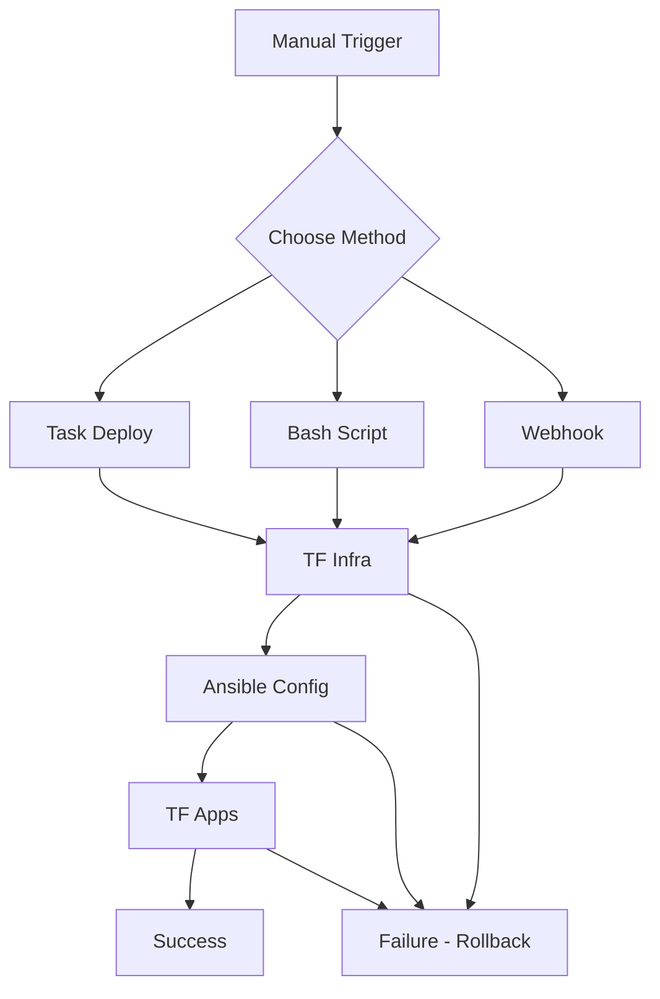

# Deployment Pipeline Coupling Plan

## Overview
This plan outlines low-key, self-hosted methods to loosely couple your Terraform → Ansible → Terraform (apps) deployment stages, providing both sequential automation and event-driven capabilities without requiring a full CI/CD server.

## Current Setup Analysis
- **Stage 1**: `task tf:apply` - Provisions infrastructure on Proxmox
- **Stage 2**: `task ansible:site:apply` - Configures systems (Docker Swarm, etc.)
- **Stage 3**: `task tfa:apply` - Deploys Docker stacks via Portainer
- All stages run manually with Doppler for secrets management

## Proposed Solutions

### Option 1: Sequential Automation (Recommended - Simplest)
**Implementation**: Added `task deploy` to main Taskfile.yml that runs all stages sequentially.

**Usage**:
```bash
task deploy
```

**Pros**:
- Zero additional dependencies
- Leverages existing Task infrastructure
- Simple one-command deployment
- Clear error propagation (stops on failure)

**Cons**:
- No intermediate visibility or manual intervention points
- All-or-nothing execution

### Option 2: Bash Script with Enhanced Control
**Implementation**: Created `scripts/deploy.sh` with explicit stage logging and error handling.

**Usage**:
```bash
./scripts/deploy.sh
```

**Features**:
- Detailed logging per stage
- Clear success/failure messages
- Exit on any stage failure
- Easy to modify for custom logic

**Pros**:
- More control than Task alone
- Better visibility into progress
- Can add notifications (email, Discord, etc.)
- Easy to extend with pre/post-stage hooks

**Cons**:
- Slightly more complex than pure Task
- Requires script execution permissions

### Option 3: Event-Driven with Webhook Receiver
**Implementation**: Use [webhook](https://github.com/adnanh/webhook) as a self-hosted webhook receiver.

**Setup**:
1. Run webhook container or binary
2. Configure hooks to trigger deployment stages
3. Expose via Tailscale or Cloudflare Tunnel for external triggers

**Pros**:
- True event-driven (external triggers possible)
- Can integrate with Git commits, manual buttons, etc.
- Asynchronous execution

**Cons**:
- Additional service to maintain
- Requires networking setup for external access
- More complex configuration

## Implementation Plan

### Phase 1: Sequential Automation (Immediate)
1. Use the new `task deploy` command for full pipeline runs
2. Test in staging/development environment
3. Update documentation

### Phase 2: Enhanced Scripting (Optional)
1. Use `scripts/deploy.sh` for better logging
2. Add notifications if desired (Discord webhook, etc.)
3. Implement rollback on failure

### Phase 3: Event-Driven (Future)
1. Evaluate need for external triggering
2. Implement webhook receiver if required
3. Integrate with Git hooks or external systems

## Testing Strategy
1. **Dry Runs**: Use `task tf:plan`, `task ansible:site:plan` before full deployment
2. **Staging**: Test pipeline on non-production infrastructure
3. **Incremental**: Test each stage individually before full pipeline
4. **Rollback**: Have destroy commands ready (`task tf:destroy`, `task tfa:destroy`)

## Rollback Procedures
- **Infrastructure**: `task tf:destroy` (removes VMs)
- **Apps**: `task tfa:destroy` (removes stacks)
- **Configuration**: Manual Ansible rollback or re-run with different playbook

## Mermaid Diagram



## Recommendations
1. **Start with Option 1** (`task deploy`) - it's the simplest and meets your sequential automation needs
2. **Upgrade to Option 2** if you need better logging or notifications
3. **Consider Option 3** only if you need external triggering (Git pushes, API calls, etc.)

All options remain self-hosted, cheap, and avoid full CI/CD servers as requested.
